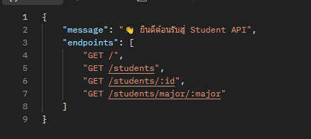
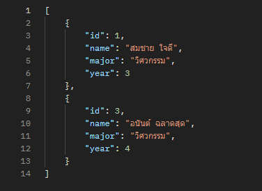
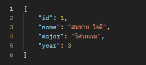
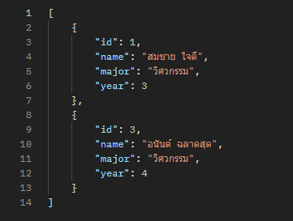
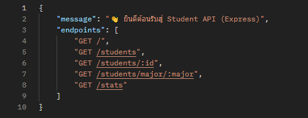
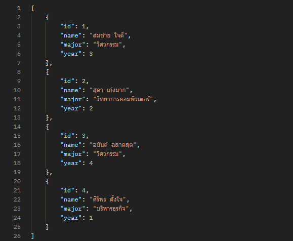
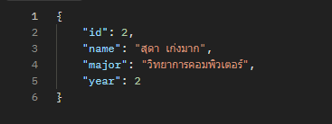
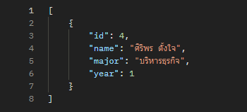
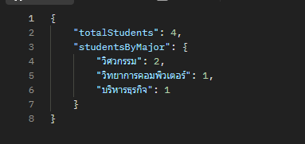

# 🧑‍💻 Student API — HTTP & Express

โปรเจกต์นี้แสดงตัวอย่างการสร้าง REST API 2 แบบได้แก่ :
1. `http-server.js` — ใช้ Node.js HTTP core module
2. `express-server.js` — ใช้ Express Framework

---

## 📦 การติดตั้ง
- npm install express

## 🚀 การรัน Server
HTTP Server
- node http-server.js

Express Server
- node express-server.js

## การทดสอบ 
จะใช้ Curl ใน cmd หรือ terminal ก็ได้ หรือจะใช้โปรแกรมภายนอกเช่น Postman ก็ได้เช่นกัน
### ✅ HTTP Server
curl http://localhost:3000/

curl http://localhost:3000/students

curl http://localhost:3000/students/1

curl http://localhost:3000/students/major/วิศวกรรม

### ✅ Express Server
curl http://localhost:3001/

curl http://localhost:3001/students

curl http://localhost:3001/students/2

curl http://localhost:3001/students/major/บริหารธุรกิจ

curl http://localhost:3001/stats

