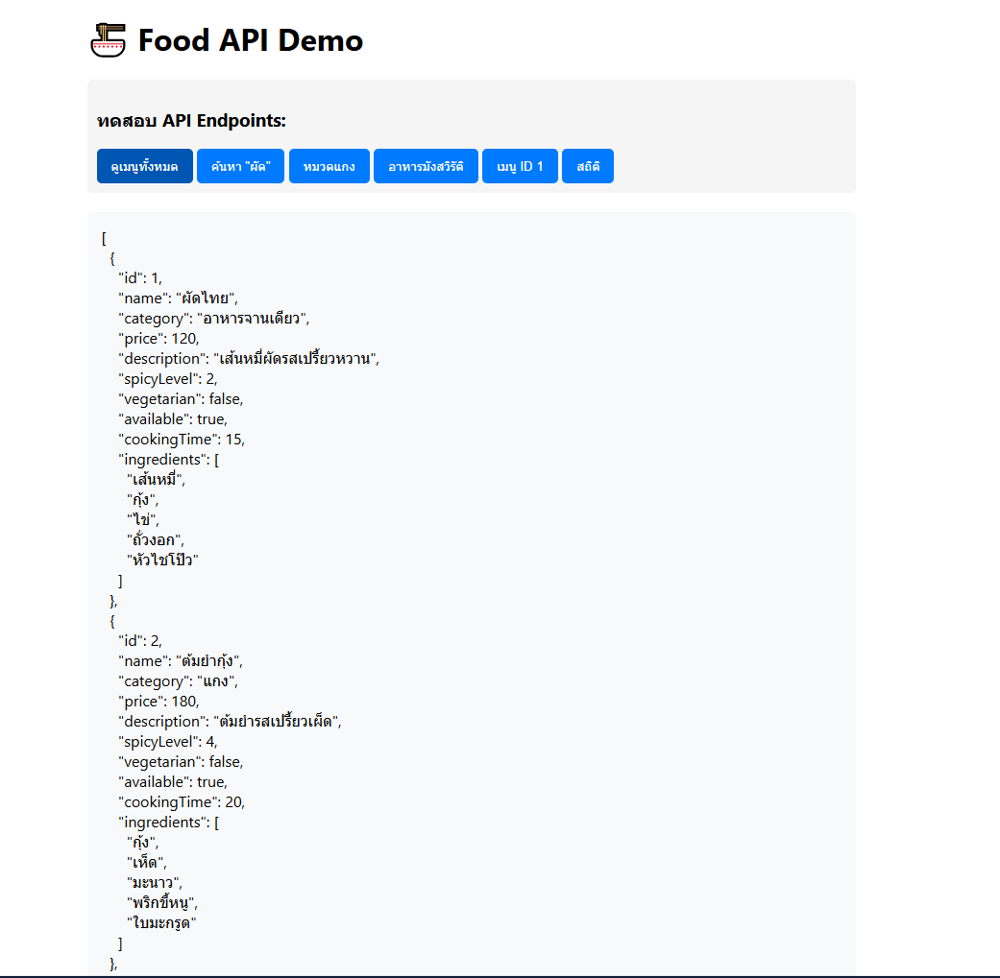
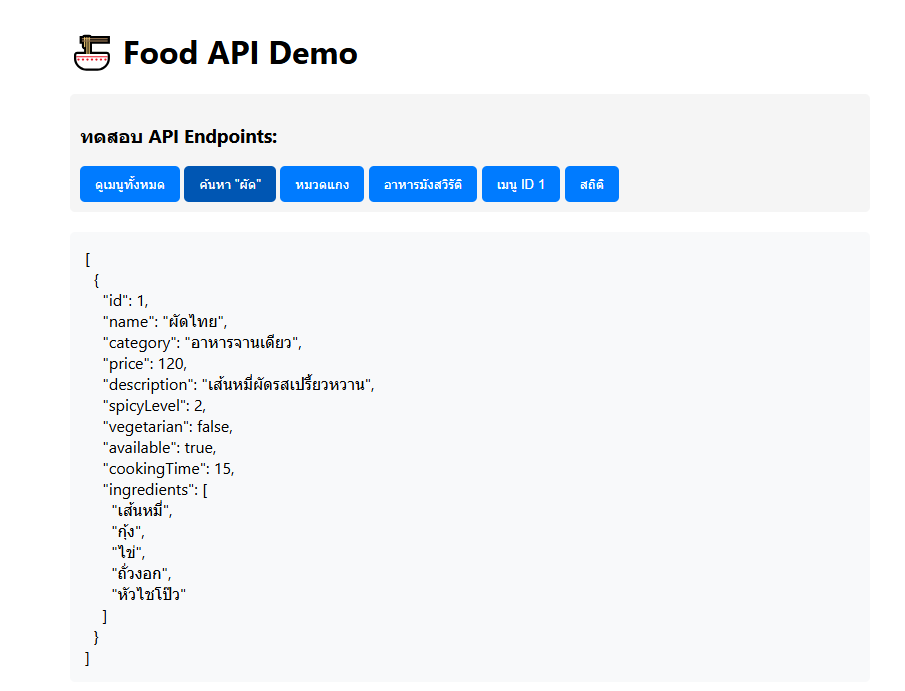
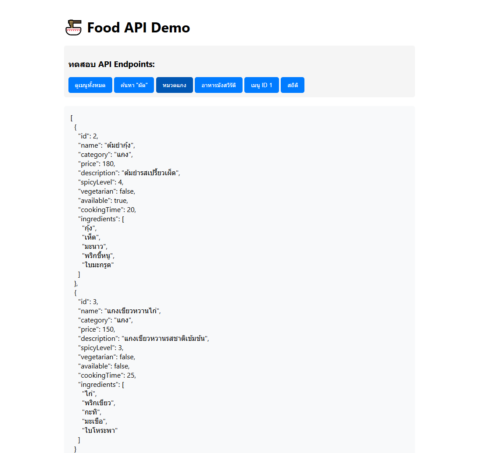
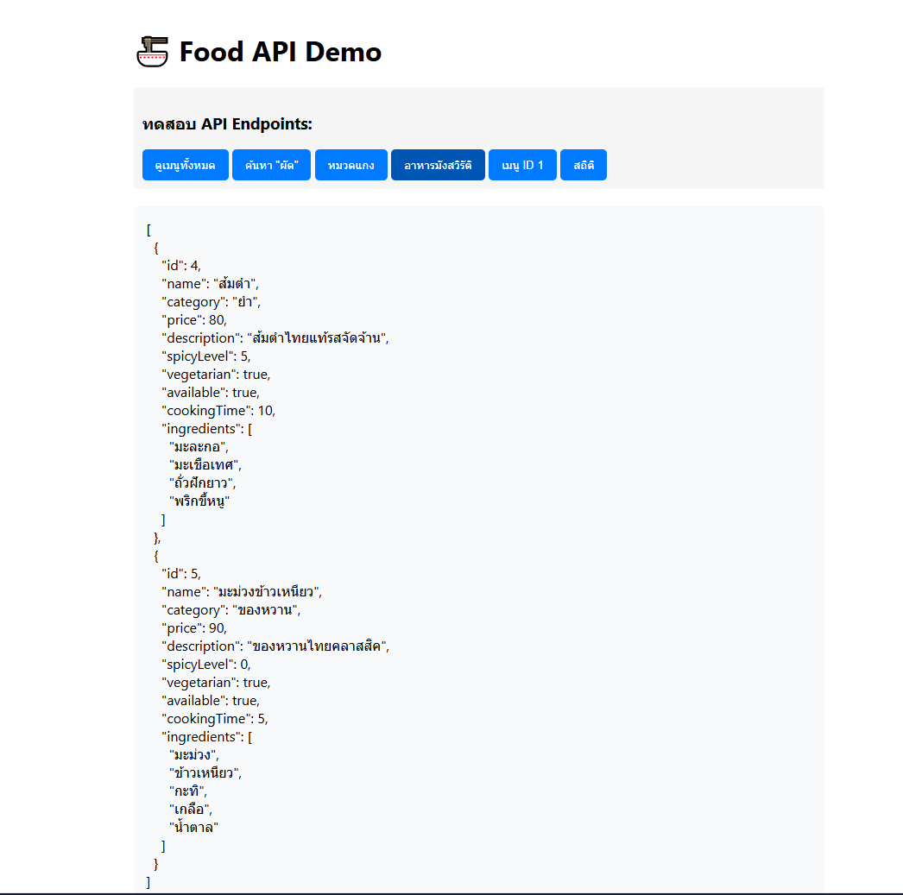
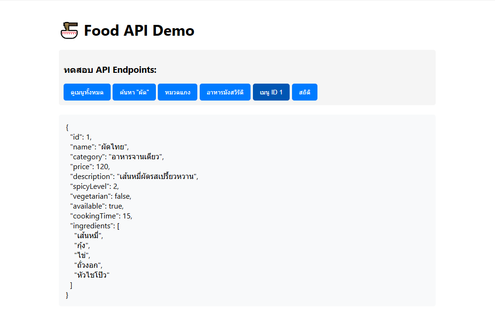
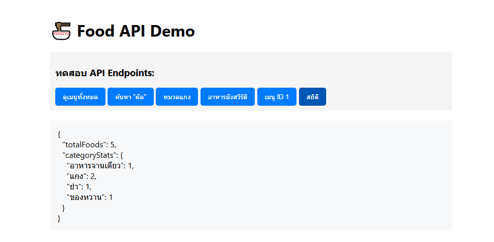
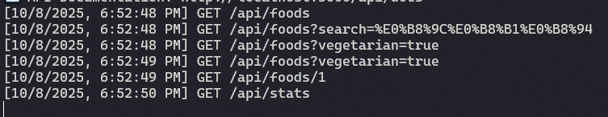

# 🍜 Food API

API ตัวอย่างสำหรับ Lab 4.2  
Node.js + Express

## 🚀 การติดตั้ง
```bash
npm install
npm run dev
```

---

## ✅ Checklist

### Filtering ใช้งานได้ครบทุก parameter  
ดูเมนูทั้งหมด



ค้นหา "ผัด"



หมวดแกง



อาหารมังสวิรัติ



เมนู ID 1



สถิติ



Logger



---


