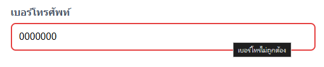
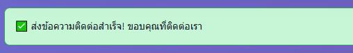
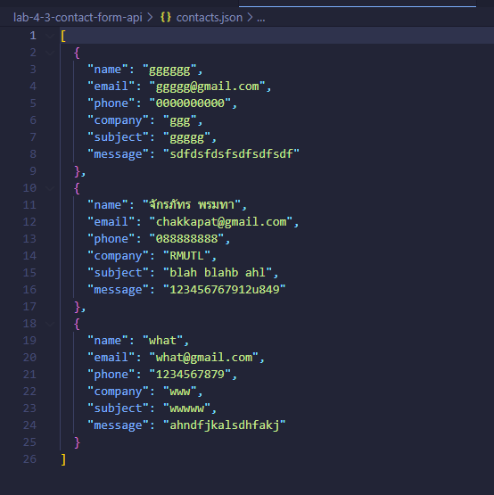
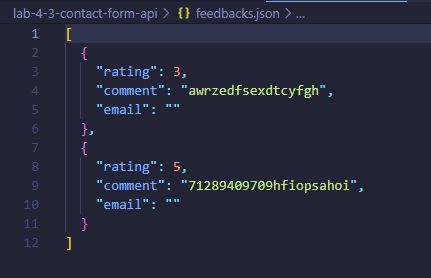
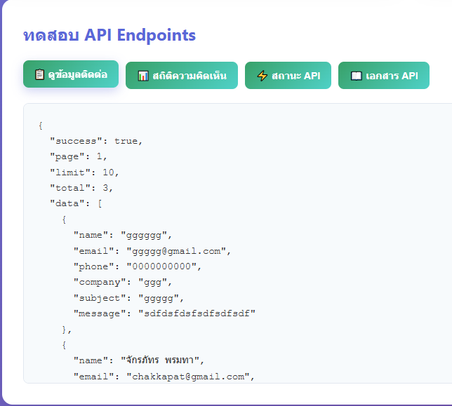
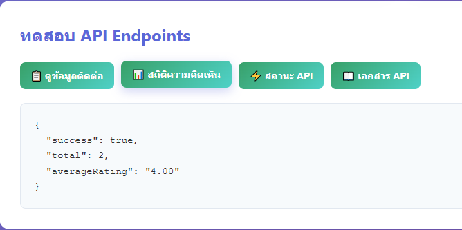

# Lab 4.3: Contact Form API


โดยเราจะสร้าง Contact Form API พร้อมระบบ **validation**, **file storage**, และ **frontend ทดสอบ API**
โดยใช้ Express.js และเก็บข้อมูลในรูปแบบ JSON ไฟล์


## 🚀 การติดตั้งและรันโปรเจค

```bash
# ติดตั้ง dependencies
npm install

# รันโปรเจค (ปกติ)
npm start

# หรือใช้ nodemon (โหมดพัฒนา)
npm run dev
```

---

## Testing Sections

### ✅ 1. Contact form validation

* โดยจะเป็นการตรวจสอบว่าในทุกๆ Field นั้นถูกต้องหรือไม่ เช่น:



### ✅ 2. Feedback form

* โดยตัว Feedback Form นั้นจะสามารถรับข้อมูลจากผู้ใช้ผ่าน API หรือหน้า Website ได้ โดยจะจัดเก็บข้อมูลไว้ใน Storage เมื่อรับข้อมูลเข้ามาใหม่



### ✅ 3. File Storage

* สามารถเก็บข้อมูลลง File ได้

**contacts.json**



**feedback.json**



### ✅ 4. API Endpoint

* โดย API นั้นสามารถที่จะตอบสนองต่อคำสั่งจากผู้ใช้ได้อย่างถูกต้อง

**ดูข้อมูลติดต่อ**



**สถิติความคิดเห็น**



---

โดยรวมแล้ว Website สามารถใช้งานได้จริง และ API สามารถใช้ร่วมกันได้

---

### DEMO VIDEO ฟีเจอร์ต่างๆ

[](https://youtu.be/Q35BpQeR2Tc)

